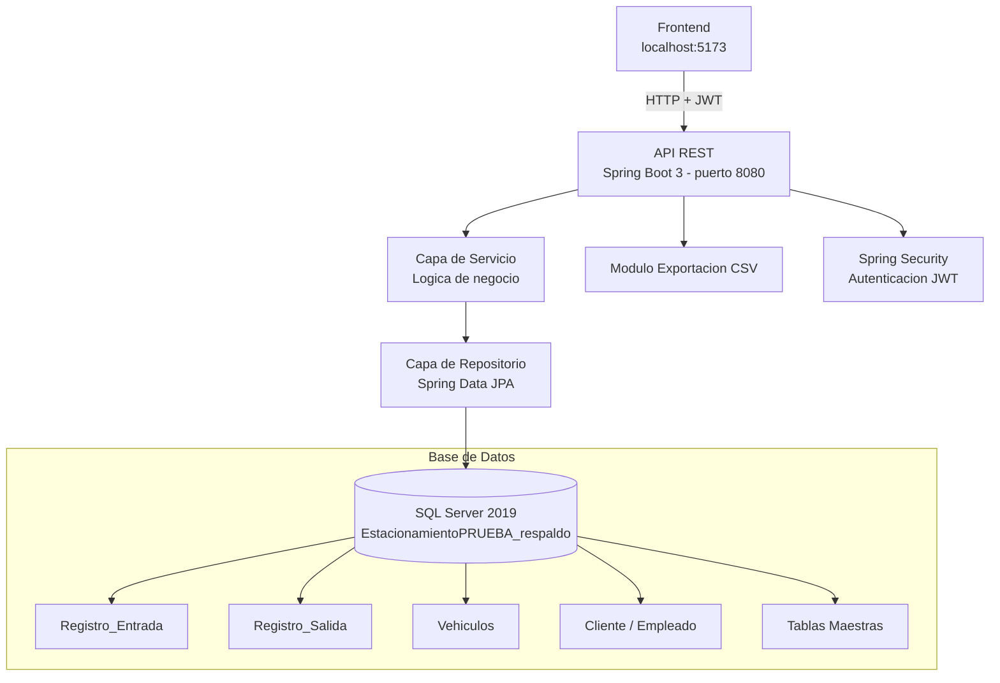
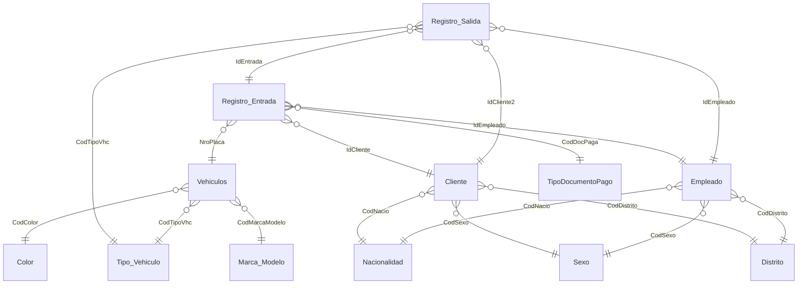

# Sistema de Gestión de Estacionamiento

Backend REST desarrollado con Spring Boot 3 y Java 17 que expone una API para registrar la entrada y salida de vehículos en un estacionamiento, gestionar clientes y empleados, y exportar reportes en formato CSV. La autenticación está protegida con JWT.

---

## Tabla de Contenidos
- [Descripción](#descripción)
- [Características](#características)
- [Arquitectura](#arquitectura)
- [Tecnologías Usadas](#tecnologías-usadas)
- [Instalación](#instalación)
- [Uso](#uso)
- [Estructura del Proyecto](#estructura-del-proyecto)
- [Base de Datos](#base-de-datos)
- [Pruebas](#pruebas)
- [Roadmap](#roadmap)
- [Contribuciones](#contribuciones)
- [Licencia](#licencia)
- [Contacto](#contacto)

---

## Descripción

Este proyecto resuelve la necesidad de controlar el flujo vehicular en un estacionamiento de forma digital y ordenada, reemplazando el registro manual en papel.

> El sistema expone una **API REST** que permite registrar la entrada y salida de vehículos con asignación de zona y nivel, vincular cada operación a un cliente y un empleado responsable, y generar reportes exportables en CSV. El acceso a los endpoints está protegido mediante **JWT**.

**Dirigido a:** administradores y operadores de estacionamientos públicos o privados.  
**Base de datos:** `EstacionamientoPRUEBA_respaldo` — SQL Server 2019, collation `Modern_Spanish_CI_AS`  
**Puerto del servidor:** `8080`

---

## Características

- Registro de entrada de vehículos (NroPlaca, zona, nivel, fecha/hora automática)
- Registro de salida vinculado al registro de entrada correspondiente
- Autenticación con JWT (Spring Security)
- Gestión de clientes con datos personales, licencia y contacto
- Gestión de empleados con credenciales de acceso
- Catálogo de vehículos con marca/modelo, color, tipo y lunas polarizadas
- Exportación de registros a archivo CSV
- Búsqueda por número de placa o documento
- Tablas maestras configurables: Nacionalidad, Sexo, Distrito, Color, Marca/Modelo, Tipo de Vehículo, Tipo Documento de Pago
- CORS habilitado para frontend en `http://localhost:5173`

---

## Arquitectura

El sistema es un **backend REST de 3 capas** construido sobre Spring Boot 3, que sirve una API consumida por un frontend separado (puerto 5173).



---

## Tecnologías Usadas

| Capa | Tecnología |
|---|---|
| Lenguaje | Java 17 |
| Framework | Spring Boot 3.5.0 |
| Seguridad | Spring Security + JWT (jjwt 0.11.5) |
| Persistencia | Spring Data JPA + Hibernate |
| Base de datos | Microsoft SQL Server 2019 |
| Driver BD | mssql-jdbc |
| Build | Maven |
| Utilidades | Lombok, Spring Boot DevTools |
| Usuario BD | `estacionamiento_user` |
| Control de versiones | Git / GitHub |

---

## Instalación

### Requisitos previos

- Java JDK 17 o superior
- Maven 3.6 o superior
- Microsoft SQL Server 2019 (o SQL Server Express)
- SQL Server Management Studio (SSMS) — recomendado

### Paso 1 — Clonar el repositorio

```bash
git clone https://github.com/tu-usuario/estacionamiento-backend.git
cd estacionamiento-backend
```

### Paso 2 — Restaurar la base de datos

1. Abre SQL Server Management Studio
2. Importa el archivo de respaldo incluido en el repositorio:
   ```
   /database/EstacionamientoPRUEBA_respaldo.bacpac
   ```
3. Ve a: **File → Import Data-tier Application** y sigue el asistente
4. Crea el usuario `estacionamiento_user` con acceso a la base de datos restaurada

### Paso 3 — Configurar el archivo de propiedades

El archivo de configuración se encuentra en:

```
src/main/resources/application.properties
```

Ajusta las credenciales si es necesario:

```properties
# Servidor
server.port=8080

# SQL Server
spring.datasource.url=jdbc:sqlserver://localhost:1433;databaseName=EstacionamientoPRUEBA_respaldo;encrypt=true;trustServerCertificate=true
spring.datasource.username=estacionamiento_user
spring.datasource.password=Parking2024!
spring.datasource.driver-class-name=com.microsoft.sqlserver.jdbc.SQLServerDriver

# JPA
spring.jpa.hibernate.ddl-auto=none
spring.jpa.show-sql=false

# JWT
jwt.secret=estacionamiento2024SecretKeyMuySeguraParaProduccion
jwt.expiration=86400000

# CORS
cors.allowed-origins=http://localhost:5173,http://localhost:8080
```

### Paso 4 — Compilar y ejecutar

```bash
mvn clean install
mvn spring-boot:run
```

El servidor quedará disponible en `http://localhost:8080`.

---

## Uso

### Autenticación

Antes de consumir cualquier endpoint protegido, obtén un token JWT:

```
POST http://localhost:8080/api/auth/login
Content-Type: application/json

{
  "username": "empleado01",
  "password": "tu_password"
}
```

Usa el token recibido en el header de las siguientes peticiones:

```
Authorization: Bearer <token>
```

### Registrar entrada de vehículo

```
POST http://localhost:8080/api/registro-entrada
Authorization: Bearer <token>
Content-Type: application/json

{
  "nroPlaca": "ABC-123",
  "idCliente": "C001",
  "idEmpleado": "EMP01",
  "zona": "A",
  "nivel": 1,
  "codDocPaga": 1
}
```

### Registrar salida de vehículo

```
POST http://localhost:8080/api/registro-salida
Authorization: Bearer <token>
Content-Type: application/json

{
  "idEntrada": "E001",
  "idCliente2": "C001",
  "idEmpleado": "EMP01",
  "codTipoVhc": 1
}
```

### Exportar reporte CSV

```
GET http://localhost:8080/api/reportes/csv?fechaInicio=2025-01-01&fechaFin=2025-03-01
Authorization: Bearer <token>
```

El archivo descargado tendrá el formato:

```
IdEntrada, NroPlaca, IdCliente, IdEmpleado, Zona, Nivel, FechaIngreso, HoraIngreso
E001, ABC-123, C001, EMP01, A, 1, 2025-03-01, 08:30:00.0000
```

---

## Estructura del Proyecto

```
estacionamiento-backend/
│
├── src/
│   └── main/
│       ├── java/
│       │   └── com/estacionamiento/
│       │       ├── EstacionamientoApplication.java     # Clase principal Spring Boot
│       │       ├── config/
│       │       │   ├── SecurityConfig.java             # Configuracion Spring Security
│       │       │   └── CorsConfig.java                 # Configuracion CORS
│       │       ├── controller/
│       │       │   ├── AuthController.java             # Endpoints de autenticacion
│       │       │   ├── RegistroEntradaController.java  # Endpoints entrada
│       │       │   ├── RegistroSalidaController.java   # Endpoints salida
│       │       │   ├── ClienteController.java          # Endpoints clientes
│       │       │   └── ReporteController.java          # Endpoints exportacion CSV
│       │       ├── model/
│       │       │   ├── Cliente.java
│       │       │   ├── Empleado.java
│       │       │   ├── Vehiculo.java
│       │       │   ├── RegistroEntrada.java
│       │       │   ├── RegistroSalida.java
│       │       │   ├── Color.java
│       │       │   ├── MarcaModelo.java
│       │       │   ├── TipoVehiculo.java
│       │       │   ├── TipoDocumentoPago.java
│       │       │   ├── Nacionalidad.java
│       │       │   ├── Sexo.java
│       │       │   └── Distrito.java
│       │       ├── repository/
│       │       │   ├── ClienteRepository.java
│       │       │   ├── EmpleadoRepository.java
│       │       │   ├── VehiculoRepository.java
│       │       │   ├── RegistroEntradaRepository.java
│       │       │   └── RegistroSalidaRepository.java
│       │       ├── service/
│       │       │   ├── RegistroEntradaService.java
│       │       │   ├── RegistroSalidaService.java
│       │       │   └── ExportacionCSVService.java
│       │       └── security/
│       │           ├── JwtUtil.java                    # Generacion y validacion JWT
│       │           └── JwtFilter.java                  # Filtro de autenticacion
│       └── resources/
│           ├── application.properties                  # Configuracion principal
│           └── static/                                 # Archivos estaticos (frontend)
│
├── database/
│   └── EstacionamientoPRUEBA_respaldo.bacpac
│
├── pom.xml
└── README.md
```

---

## Base de Datos

La base de datos `EstacionamientoPRUEBA_respaldo` contiene 12 tablas organizadas en tablas maestras y tablas transaccionales.

### Tablas transaccionales principales

**`Registro_Entrada`** — Registra cada ingreso de vehículo al estacionamiento

| Campo | Tipo | Descripción |
|---|---|---|
| IdEntrada | varchar(10) PK | Identificador único de la entrada |
| IdCliente | varchar(10) FK | Cliente que ingresa |
| IdEmpleado | varchar(10) FK | Empleado que registra |
| NroPlaca | varchar(10) FK | Placa del vehículo |
| CodDocPaga | int FK | Tipo de documento de pago |
| NroDocumento | int | Número de documento de pago |
| Nivel | int | Nivel del estacionamiento |
| Zona | varchar(20) | Zona asignada |
| FechaIngreso | datetime | Fecha de ingreso |
| HoraIngreso | time(4) | Hora exacta de ingreso |

**`Registro_Salida`** — Registra cada salida, vinculada a su entrada

| Campo | Tipo | Descripción |
|---|---|---|
| IdSalida | varchar(10) PK | Identificador único de la salida |
| IdEntrada | varchar(10) FK | Referencia a Registro_Entrada |
| IdCliente2 | varchar(10) FK | Cliente que sale |
| IdEmpleado | varchar(10) FK | Empleado que registra |
| CodTipoVhc | int FK | Tipo de vehículo al salir |
| FechaSalida | datetime | Fecha de salida |
| HoraSalida | time(4) | Hora exacta de salida |

**`Vehiculos`** — Catálogo de vehículos registrados

| Campo | Tipo | Descripción |
|---|---|---|
| NroPlaca | varchar(10) PK | Número de placa |
| CodColor | int FK | Color del vehículo |
| CodTipoVhc | int FK | Tipo de vehículo |
| CodMarcaModelo | int FK | Marca y modelo |
| Lunas_Polarizadas | varchar(10) | Indica si tiene lunas polarizadas |

**`Cliente`** — Datos de clientes del estacionamiento

| Campo | Tipo | Descripción |
|---|---|---|
| IdCliente | varchar(10) PK | Identificador único |
| Nombres | varchar(15) | Nombres |
| Apellidos | varchar(15) | Apellidos |
| NumDoc | varchar(15) UNIQUE | Número de documento de identidad |
| NroLicencia | int | Número de licencia de conducir |
| Telefono | int | Teléfono de contacto |
| Correo | varchar(20) | Correo electrónico |
| Direccion | varchar(20) | Dirección |
| CodNacio | int FK | Nacionalidad |
| CodSexo | int FK | Sexo |
| CodDistrito | int FK | Distrito |

**`Empleado`** — Personal operador del sistema

| Campo | Tipo | Descripción |
|---|---|---|
| IdEmpleado | varchar(10) PK | Identificador único |
| Nombres | varchar(15) | Nombres |
| Apellidos | varchar(50) | Apellidos |
| Password | varchar(15) | Contraseña de acceso |
| NumDoc | varchar(15) UNIQUE | Documento de identidad |
| Telefono | int | Teléfono |
| Correo | varchar(50) | Correo electrónico |
| Direccion | varchar(100) | Dirección |
| CodNacio | int FK | Nacionalidad |
| CodSexo | int FK | Sexo |
| CodDistrito | int FK | Distrito |

### Tablas maestras (catálogos)

| Tabla | PK | Descripción |
|---|---|---|
| `Color` | CodColor | Colores de vehículos |
| `Marca_Modelo` | CodMarcaModelo | Marcas y modelos |
| `Tipo_Vehiculo` | CodTipoVhc | Tipos de vehículo |
| `TipoDocumentoPago` | CodDocPaga | Tipos de comprobante |
| `Nacionalidad` | CodNacio | Nacionalidades |
| `Sexo` | CodSexo | Géneros |
| `Distrito` | CodDistrito | Distritos |

### Diagrama de relaciones



---

## Pruebas

Las pruebas se realizaron de forma manual usando Postman para verificar los endpoints:

| Caso de prueba | Resultado esperado | Estado |
|---|---|---|
| Login con credenciales correctas | Token JWT retornado | ✅ |
| Login con contraseña incorrecta | HTTP 401 Unauthorized | ✅ |
| Acceder a endpoint sin token | HTTP 403 Forbidden | ✅ |
| Registrar entrada con placa nueva | Registro guardado en Registro_Entrada | ✅ |
| Registrar salida vinculada a entrada existente | Registro_Salida creado con FK correcto | ✅ |
| Exportar CSV con registros del período | Archivo descargado correctamente | ✅ |
| Registrar cliente con NumDoc duplicado | HTTP 400 - constraint UNIQUE | ✅ |
| Restaurar BD desde .bacpac | BD creada con todas las tablas y relaciones | ✅ |

---

## Roadmap

- [x] API REST con Spring Boot 3
- [x] Autenticacion con JWT y Spring Security
- [x] Registro de entrada con zona y nivel
- [x] Registro de salida vinculada a entrada
- [x] Gestion de clientes y empleados
- [x] Catalogo de vehiculos con marca, modelo, color y tipo
- [x] Exportacion a CSV
- [x] CORS configurado para frontend en puerto 5173
- [ ] Calculo automatico de tiempo de permanencia y tarifa
- [ ] Reporte grafico de ocupacion por zonas y niveles
- [ ] Documentacion de la API con Swagger / OpenAPI

---

## Contribuciones

Las contribuciones son bienvenidas. Para contribuir:

1. Haz un fork del repositorio
2. Crea una rama nueva: `git checkout -b feature/nueva-funcionalidad`
3. Realiza tus cambios y haz commit: `git commit -m "Agrega nueva funcionalidad"`
4. Sube los cambios: `git push origin feature/nueva-funcionalidad`
5. Abre un **Pull Request**

---

## Licencia

Este proyecto está bajo la licencia **MIT**. Consulta el archivo `LICENSE` para más detalles.

---

## Contacto

**Autor:** Tu nombre  
**Correo:** micorreo@uni.pe  
**Código UNI:** [99999999Z]  
**GitHub:** [github.com/tu-usuario](https://github.com/tu-usuario)

---

> Proyecto desarrollado para el curso de **Documentación de Software** — Universidad Nacional de Ingeniería (UNI)
